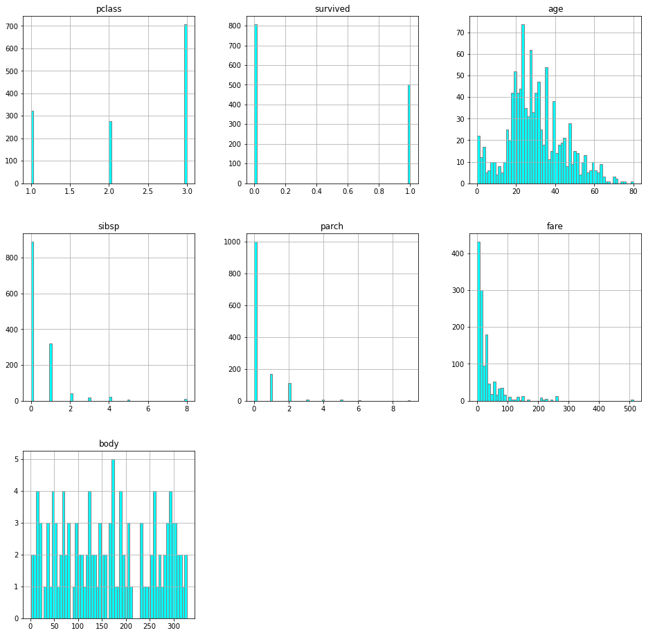
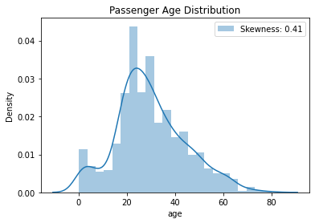
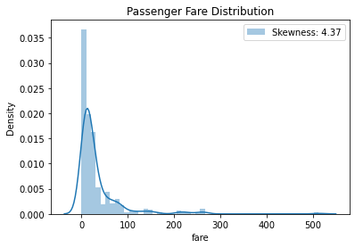
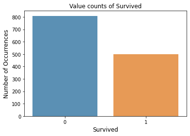
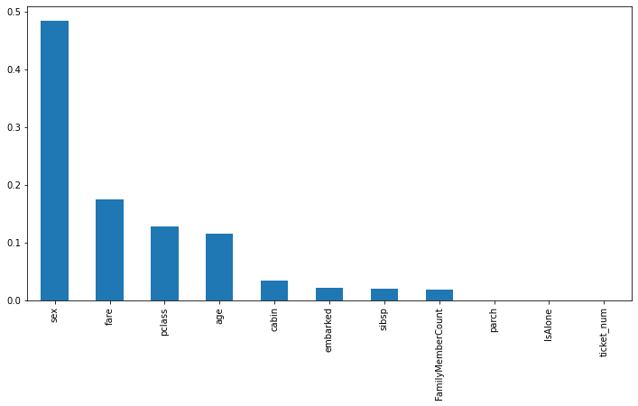

# Titanic Survival Prediction
This is one of my first Machine Learning team projects.

```python
# libraries for load
import pandas as pd
import numpy as np

# data visualization
import matplotlib.pyplot as plt
import seaborn as sns

# missing data imputation
from feature_engine.imputation  import MeanMedianImputer, ArbitraryNumberImputer, CategoricalImputer
from sklearn.impute import SimpleImputer

# data prepocessing
from sklearn.compose import ColumnTransformer
from sklearn.pipeline import Pipeline
from sklearn.model_selection import train_test_split, GridSearchCV

# feature scaling
from sklearn.preprocessing import (
    StandardScaler,
    MinMaxScaler,
    RobustScaler,
    FunctionTransformer
)

# encoding
from feature_engine.encoding import RareLabelEncoder, OrdinalEncoder

# ML models
from sklearn.linear_model import LogisticRegression
from sklearn.neighbors import KNeighborsClassifier
from sklearn.ensemble import GradientBoostingClassifier, RandomForestClassifier
from sklearn.svm import SVC

# metrics
from sklearn.metrics import roc_auc_score

# set random seed
np.random.seed(0)

# suppress warning messages
import warnings
warnings.filterwarnings('ignore')
```


```python
data = pd.read_csv('data/titanic.csv')
data.head()
```


<div>
<style scoped>
    .dataframe tbody tr th:only-of-type {
        vertical-align: middle;
    }

    .dataframe tbody tr th {
        vertical-align: top;
    }

    .dataframe thead th {
        text-align: right;
    }
</style>
<table border="1" class="dataframe">
  <thead>
    <tr style="text-align: right;">
      <th></th>
      <th>pclass</th>
      <th>survived</th>
      <th>name</th>
      <th>sex</th>
      <th>age</th>
      <th>sibsp</th>
      <th>parch</th>
      <th>ticket</th>
      <th>fare</th>
      <th>cabin</th>
      <th>embarked</th>
      <th>boat</th>
      <th>body</th>
      <th>home.dest</th>
    </tr>
  </thead>
  <tbody>
    <tr>
      <th>0</th>
      <td>1</td>
      <td>1</td>
      <td>Allen, Miss. Elisabeth Walton</td>
      <td>female</td>
      <td>29.0000</td>
      <td>0</td>
      <td>0</td>
      <td>24160</td>
      <td>211.3375</td>
      <td>B5</td>
      <td>S</td>
      <td>2</td>
      <td>NaN</td>
      <td>St Louis, MO</td>
    </tr>
    <tr>
      <th>1</th>
      <td>1</td>
      <td>1</td>
      <td>Allison, Master. Hudson Trevor</td>
      <td>male</td>
      <td>0.9167</td>
      <td>1</td>
      <td>2</td>
      <td>113781</td>
      <td>151.5500</td>
      <td>C22</td>
      <td>S</td>
      <td>11</td>
      <td>NaN</td>
      <td>Montreal, PQ / Chesterville, ON</td>
    </tr>
    <tr>
      <th>2</th>
      <td>1</td>
      <td>0</td>
      <td>Allison, Miss. Helen Loraine</td>
      <td>female</td>
      <td>2.0000</td>
      <td>1</td>
      <td>2</td>
      <td>113781</td>
      <td>151.5500</td>
      <td>C22</td>
      <td>S</td>
      <td>NaN</td>
      <td>NaN</td>
      <td>Montreal, PQ / Chesterville, ON</td>
    </tr>
    <tr>
      <th>3</th>
      <td>1</td>
      <td>0</td>
      <td>Allison, Mr. Hudson Joshua Creighton</td>
      <td>male</td>
      <td>30.0000</td>
      <td>1</td>
      <td>2</td>
      <td>113781</td>
      <td>151.5500</td>
      <td>C22</td>
      <td>S</td>
      <td>NaN</td>
      <td>135.0</td>
      <td>Montreal, PQ / Chesterville, ON</td>
    </tr>
    <tr>
      <th>4</th>
      <td>1</td>
      <td>0</td>
      <td>Allison, Mrs. Hudson J C (Bessie Waldo Daniels)</td>
      <td>female</td>
      <td>25.0000</td>
      <td>1</td>
      <td>2</td>
      <td>113781</td>
      <td>151.5500</td>
      <td>C22</td>
      <td>S</td>
      <td>NaN</td>
      <td>NaN</td>
      <td>Montreal, PQ / Chesterville, ON</td>
    </tr>
  </tbody>
</table>
</div>


## Data Exploration


```python
data.info()
```

    <class 'pandas.core.frame.DataFrame'>
    RangeIndex: 1309 entries, 0 to 1308
    Data columns (total 14 columns):
     #   Column     Non-Null Count  Dtype  
    ---  ------     --------------  -----  
     0   pclass     1309 non-null   int64  
     1   survived   1309 non-null   int64  
     2   name       1309 non-null   object 
     3   sex        1309 non-null   object 
     4   age        1046 non-null   float64
     5   sibsp      1309 non-null   int64  
     6   parch      1309 non-null   int64  
     7   ticket     1309 non-null   object 
     8   fare       1308 non-null   float64
     9   cabin      295 non-null    object 
     10  embarked   1307 non-null   object 
     11  boat       486 non-null    object 
     12  body       121 non-null    float64
     13  home.dest  745 non-null    object 
    dtypes: float64(3), int64(4), object(7)
    memory usage: 143.3+ KB
    


```python
# numerical features distribution
fig_ = data.hist(figsize=(16, 16), bins=60, color="cyan",
                         edgecolor="gray", xlabelsize=10, ylabelsize=10)
```


    

    


```python
#correlation matrix
corrmat = data.corr()
f, ax = plt.subplots(figsize=(12, 9))
sns.heatmap(corrmat, vmax=.8, square=True);
plt.savefig("corrmat.png")
```


    

    


```python
# check distribution of age variable

sns.distplot(data['age'], label = 'Skewness: %.2f'%(data['age'].skew()))
plt.legend(loc = 'best')
plt.title('Passenger Age Distribution')
```


    Text(0.5, 1.0, 'Passenger Age Distribution')


    

    


```python
# check distribution of fare variable

sns.distplot(data['fare'], label = 'Skewness: %.2f'%(data['fare'].skew()))
plt.legend(loc = 'best')
plt.title('Passenger Fare Distribution')
```


    Text(0.5, 1.0, 'Passenger Fare Distribution')


    

    


```python
survived_count = data['survived'].value_counts(dropna = False)
survived_count
```


    0    809
    1    500
    Name: survived, dtype: int64


```python
# check distribution of target variable

sns.barplot(survived_count.index, survived_count.values, alpha = 0.8)
plt.title('Value counts of Survived')
plt.ylabel('Number of Occurrences', fontsize = 12)
plt.xlabel('Survived', fontsize = 12)
plt.show()
```


    

    


## Feature Engineering


```python
# remove useless features name, home.dest and body.
# remove boat feature. This variable has too much correlation with target variable.
data = data.drop(['name', 'home.dest', 'body', 'boat'], axis=1)
data.head()
```


<div>
<style scoped>
    .dataframe tbody tr th:only-of-type {
        vertical-align: middle;
    }

    .dataframe tbody tr th {
        vertical-align: top;
    }

    .dataframe thead th {
        text-align: right;
    }
</style>
<table border="1" class="dataframe">
  <thead>
    <tr style="text-align: right;">
      <th></th>
      <th>pclass</th>
      <th>survived</th>
      <th>sex</th>
      <th>age</th>
      <th>sibsp</th>
      <th>parch</th>
      <th>ticket</th>
      <th>fare</th>
      <th>cabin</th>
      <th>embarked</th>
    </tr>
  </thead>
  <tbody>
    <tr>
      <th>0</th>
      <td>1</td>
      <td>1</td>
      <td>female</td>
      <td>29.0000</td>
      <td>0</td>
      <td>0</td>
      <td>24160</td>
      <td>211.3375</td>
      <td>B5</td>
      <td>S</td>
    </tr>
    <tr>
      <th>1</th>
      <td>1</td>
      <td>1</td>
      <td>male</td>
      <td>0.9167</td>
      <td>1</td>
      <td>2</td>
      <td>113781</td>
      <td>151.5500</td>
      <td>C22</td>
      <td>S</td>
    </tr>
    <tr>
      <th>2</th>
      <td>1</td>
      <td>0</td>
      <td>female</td>
      <td>2.0000</td>
      <td>1</td>
      <td>2</td>
      <td>113781</td>
      <td>151.5500</td>
      <td>C22</td>
      <td>S</td>
    </tr>
    <tr>
      <th>3</th>
      <td>1</td>
      <td>0</td>
      <td>male</td>
      <td>30.0000</td>
      <td>1</td>
      <td>2</td>
      <td>113781</td>
      <td>151.5500</td>
      <td>C22</td>
      <td>S</td>
    </tr>
    <tr>
      <th>4</th>
      <td>1</td>
      <td>0</td>
      <td>female</td>
      <td>25.0000</td>
      <td>1</td>
      <td>2</td>
      <td>113781</td>
      <td>151.5500</td>
      <td>C22</td>
      <td>S</td>
    </tr>
  </tbody>
</table>
</div>


```python
# transform cabin feature to categorical variable
cabin_only = data[["cabin"]].copy()
cabin_only["Deck"] = cabin_only["cabin"].str.slice(0,1)
data = data.assign(cabin = cabin_only["Deck"])
data.head()
```


<div>
<style scoped>
    .dataframe tbody tr th:only-of-type {
        vertical-align: middle;
    }

    .dataframe tbody tr th {
        vertical-align: top;
    }

    .dataframe thead th {
        text-align: right;
    }
</style>
<table border="1" class="dataframe">
  <thead>
    <tr style="text-align: right;">
      <th></th>
      <th>pclass</th>
      <th>survived</th>
      <th>sex</th>
      <th>age</th>
      <th>sibsp</th>
      <th>parch</th>
      <th>ticket</th>
      <th>fare</th>
      <th>cabin</th>
      <th>embarked</th>
    </tr>
  </thead>
  <tbody>
    <tr>
      <th>0</th>
      <td>1</td>
      <td>1</td>
      <td>female</td>
      <td>29.0000</td>
      <td>0</td>
      <td>0</td>
      <td>24160</td>
      <td>211.3375</td>
      <td>B</td>
      <td>S</td>
    </tr>
    <tr>
      <th>1</th>
      <td>1</td>
      <td>1</td>
      <td>male</td>
      <td>0.9167</td>
      <td>1</td>
      <td>2</td>
      <td>113781</td>
      <td>151.5500</td>
      <td>C</td>
      <td>S</td>
    </tr>
    <tr>
      <th>2</th>
      <td>1</td>
      <td>0</td>
      <td>female</td>
      <td>2.0000</td>
      <td>1</td>
      <td>2</td>
      <td>113781</td>
      <td>151.5500</td>
      <td>C</td>
      <td>S</td>
    </tr>
    <tr>
      <th>3</th>
      <td>1</td>
      <td>0</td>
      <td>male</td>
      <td>30.0000</td>
      <td>1</td>
      <td>2</td>
      <td>113781</td>
      <td>151.5500</td>
      <td>C</td>
      <td>S</td>
    </tr>
    <tr>
      <th>4</th>
      <td>1</td>
      <td>0</td>
      <td>female</td>
      <td>25.0000</td>
      <td>1</td>
      <td>2</td>
      <td>113781</td>
      <td>151.5500</td>
      <td>C</td>
      <td>S</td>
    </tr>
  </tbody>
</table>
</div>


```python
data.ticket.unique()
```


    array(['24160', '113781', '19952', '13502', '112050', '11769', 'PC 17609',
           'PC 17757', 'PC 17477', '19877', '27042', 'PC 17318', 'PC 17558',
           '11813', '13050', '11751', '111369', 'PC 17483', '13905', '11967',
           'PC 17760', '110564', '113784', '112277', '36928', '113783',
           '110489', 'PC 17608', '113505', '111427', '113054', 'PC 17591',
           '112379', 'PC 17610', '16966', '113050', '113798', 'PC 17476',
           'PC 17606', 'PC 17755', '695', '113059', '113760', '19924',
           '17770', 'W.E.P. 5734', '113806', '110152', 'PC 17594', '112051',
           '13508', '110465', '5727', 'PC 17756', '11770', '113791',
           'WE/P 5735', '112901', 'PC 17599', '113055', '113804',
           'F.C. 12750', '17474', '33638', 'PC 17761', '11755', 'PC 17485',
           'PC 17580', '11767', '36947', 'PC 17531', 'PC 17598', '17421',
           'PC 17474', '113051', '19950', '113778', 'PC 17611', '17765',
           '13568', '13567', '112058', '113803', '111320', '113503', '112378',
           'PC 17593', '17453', 'PC 17754', '113780', '112053', 'PC 17582',
           'PC 17759', '11765', 'PC 17572', '113796', '36973', '112059',
           '16988', '12749', '113038', '17463', '680', '111361', '113789',
           '111426', '19943', 'PC 17600', '113572', 'PC 17595', '694',
           '113044', '11771', '17464', '11753', '113028', '17465', 'PC 17612',
           '17475', '112377', 'PC 17592', '113501', '113801', 'PC 17569',
           '110469', '11774', '113773', 'PC 17482', 'PC 17473', 'PC 17604',
           '13509', '19928', '13236', '113787', 'PC 17596', '35273', '11752',
           '693', 'PC 17758', 'F.C. 12998', '113509', 'PC 17562', '112052',
           '113043', '113776', '113786', '19972', 'PC 17607', 'PC 17590',
           '111428', '113767', 'PC 17613', 'PC 17585', '13049', 'PC 17603',
           '113790', '19988', '111163', '113794', 'PC 17475', '13507',
           '13213', '113788', '113792', '17764', '13695', '113056', '21228',
           '13214', '113514', '11778', 'PC 17605', '36963', '17466', '110413',
           '19996', '2543', 'PC 17601', '111240', '36967', '110813', '113800',
           '35281', '113795', 'PC 17597', '113510', '19947', '113807',
           'P/PP 3381', '248744', '231945', 'C.A. 34050', '226875', '244346',
           '29108', 'C.A. 31030', '28551', 'C.A./SOTON 34068', 'S.O.P. 1166',
           '2908', '244358', '230136', '248698', '28404', '28425', '237670',
           '211535', '220367', '248733', '29750', '236853', '27849', '234686',
           '244310', '236852', '248738', 'F.C.C. 13528', '239853', '28424',
           '244252', '248731', 'SC/AH 29037', '237789', '2003', 'W./C. 14263',
           '248740', '28034', 'C.A. 31921', 'W./C. 14266', '237249',
           'F.C.C. 13534', '29107', 'C.A. 33112', 'S.O.C. 14879', '237668',
           '244360', 'SC/PARIS 2167', 'C.A. 31029', '231919', '28403',
           '28220', 'SC/PARIS 2149', 'SC/PARIS 2148', '29751', '236854',
           '236171', '2926', 'C.A. 15185', '229236', '239854', '237671',
           '239865', '28664', '243880', '31028', 'C.A. 30769', '28133',
           '28134', '248726', '233866', '12233', '250646', '250647', '250653',
           '250649', '248746', '248727', 'S.W./PP 752', 'W/C 14208',
           'F.C.C. 13529', '220845', '248706', '250650', '29105', '29104',
           '242963', '250643', '26707', '237798', '24065', 'SCO/W 1585',
           'SO/C 14885', '243847', '237565', 'C.A. 33111', 'SC/AH Basle 541',
           '244367', '226593', '233734', '223596', '219533', '239855',
           'C.A. 18723', '250651', '240261', 'SC/Paris 2123', 'SC 1748',
           'C.A. 34260', 'SC/Paris 2163', 'C.A. 29566', '235509',
           'SC/AH 3085', 'S.O./P.P. 3', '237735', 'S.C./PARIS 2079',
           'SC/A.3 2861', '28228', '239059', '237216', '233478', '250644',
           'SW/PP 751', '248723', '234360', 'C.A. 24580', '211536', '29011',
           '250655', '240276', '237736', '230080', '244368', '218629',
           'SC/PARIS 2166', 'C.A. 29395', '28213', 'W./C. 14260',
           'SC/PARIS 2146', '244278', 'SC/PARIS 2147', 'SC 14888', '230433',
           '28665', 'SC/PARIS 2131', '237393', 'S.O./P.P. 2', '234604',
           'C.A. 34644', 'SC/PARIS 2168', '26360', 'C.A. 17248', '31027',
           '230434', 'SC/PARIS 2133', '29106', 'W./C. 14258', '28004',
           'C.A. 31026', '248659', '244361', '250652', '250648', '237442',
           '234818', '28206', '31418', 'C.A. 29178', '237734', 'F.C.C. 13540',
           '248734', 'F.C.C. 13531', '233639', '240929', '34218', '11668',
           '28221', 'CA 31352', '28666', '239856', 'C.A. 33595', '27267',
           '228414', '29103', 'C.A. 34651', 'C.A. 24579', 'SC/PARIS 2159',
           '244270', '244373', '220844', '248747', 'C.A. 5547', 'C.A. 2673',
           '348125', '348122', 'SOTON/O2 3101284', '2657', 'C 7076', '341826',
           '7546', '392091', '2699', '3474', 'SOTON/O2 3101287',
           'SOTON/O.Q. 3101311', 'SOTON/O.Q. 3101312', '373450', '2223',
           'C 4001', '350046', '347082', '3101281', '347091', '350043',
           '347075', '347466', '349202', '349237', '349911',
           'SOTON/O.Q. 3101310', '347077', '350054', '2696', '2692',
           'SOTON/O.Q. 3101309', '2627', '2694', '347468', '2687', '2679',
           '3101278', '2666', 'A/4 31416', '2623', '349248', '2663', '2691',
           '330844', '324669', '323951', '347068', 'PP 4348', '2622', '2648',
           '1601', '312992', '347090', '349224', '2678', '2664', '364848',
           '364849', '54636', '334914', '347471', '3460', 'A/5 21171',
           '350045', '364512', '329944', '330920', '365222', '330963',
           '315087', '315084', '315091', '315089', '315093', '315086',
           '364846', '364858', 'A./5. 2152', '2689', '350042', '350409',
           '367231', '368364', '392095', '343275', 'A/5. 13032', '343276',
           '2680', 'SOTON/O.Q. 3101307', 'A/5 3540', '371109', '349210',
           '349209', '21332', '335097', '370373', '330972', '370369',
           'A/5 3536', '349230', '349229', '349231', 'SOTON/OQ 392090',
           'C.A. 37671', '364500', 'S.P. 3464', '371362', '315090', '2698',
           '7598', '7552', '349228', '382650', '382651', '347080', '349219',
           '349203', 'A/4 48871', 'SC/A4 23568', 'A/4 48873', '386525',
           '345572', '345774', '345778', 'C.A. 2315', '349250', '349238',
           '349225', 'A/5 21172', 'A/5 21175', '330958', '349232', '315088',
           '349226', '2686', '370376', 'A/5. 10482', '364516', '368702',
           'SOTON/OQ 392083', '349241', '336439', 'S.O./P.P. 752', '347072',
           '349912', '347074', '347061', '2674', '2675', '2690', '2695',
           'A/5 3902', '2631', 'C.A. 6212', '367232', 'SOTON/O.Q. 3101308',
           '350036', '364859', '364851', '368323', '330910', '365235',
           'W./C. 6608', 'A/5 1478', '368573', 'SOTON/O.Q. 3101314', '36864',
           '358585', '349254', '14973', '35851', '335677', '363291',
           'SOTON/O.Q. 3101263', 'SOTON/O.Q. 3101306', 'CA 2144', '21440',
           '8471', '376563', '7534', '3101276', '3101277', '347069', '349236',
           'AQ/3. 30631', '65303', '65304', 'STON/O2. 3101279', '345769',
           '2693', '350026', '350025', '350029', 'W./C. 6609', '374887',
           '394140', '370375', '347089', '365226', 'STON/O2. 3101282',
           'STON/O2. 3101290', '7548', '349243', '347086', '382649',
           '3101298', 'C 7075', 'STON/O2. 3101283', '370377', 'A. 2. 39186',
           '348121', '3470', '2685', '349220', 'STON/O2. 3101270',
           'STON/O2. 3101271', '349201', '349240', '350034',
           'SOTON/O.Q. 3101305', '350050', '350047', '350048', '14313',
           '65306', '3101264', '347070', '350052', '7540', '347063', '347467',
           '347742', 'LINE', '347062', 'W./C. 6607', '349204', '350417',
           '350408', '4136', '4137', 'STON/O 2. 3101286', 'STON/O 2. 3101274',
           '8475', '349246', '350053', '347465', '350060', '349256', '2700',
           '2682', '12460', '323592', '9234', '14312', '330911', '363592',
           '368783', '2660', '367227', '367229', '36865', '315152', '315151',
           '315153', '350405', '350404', '349253', '2654', '2624', '4135',
           '349217', 'C 7077', '7935', '7545', '347067', '347065', '2620',
           '4133', 'STON/O 2. 3101292', '2683', '370371', '345781', '347071',
           '347073', '349910', 'STON/O 2. 3101285', '330971', 'S.O./P.P. 251',
           'A/5. 3336', '1222', 'A/5 21173', '315098', '347743', '347469',
           '350403', '349235', 'C.A. 42795', '370370', 'C 17369',
           'STON/O 2. 3101275', '330924', 'AQ/4 3130', 'A/S 2816',
           'STON/O 2. 3101268', '2677', '364850', '36866', '2655', '349213',
           '349257', '2649', '349255', '383123', '367228', '367226', '330932',
           '36568', '330931', '330923', '9232', '370372', '376566', '370368',
           'SOTON/O.Q. 392087', '343095', 'A.5. 11206', '368703', '345501',
           '359306', '349233', '349211', '349207', '349221', '330980',
           '348123', '392096', 'A4. 54510', '371110', '330877', '364506',
           '372622', '312991', '2661', '2626', '374746', '35852', '382653',
           'A./5. 3235', '367230', '347078', '349206', '2667', '2653',
           'A./5. 3338', '349218', '2652', '365237', '349234', '2651',
           '3101297', '363611', '347066', '347470', '350410',
           'SOTON/O2 3101272', 'STON/O 2. 3101289', 'A/4. 39886', '2697',
           '347081', '345364', '370365', '330979', '334912', '371060',
           '366713', '7267', '364856', '14311', '330959', '347085', '368402',
           '330919', 'C 17368', '4579', 'Fa 265302', '350407', '347464',
           '347079', '6563', '315085', '315096', '315094', '349244', '330909',
           '349909', '3101295', '315097', '3411', '349242',
           'SOTON/O.Q. 3101315', '343271', '345498', 'A/5 2817',
           'STON/O 2. 3101294', 'STON/O 2. 3101291', 'A/5 21174', '347083',
           '2668', '330935', '342441', '349245', '349212', '349215', '347076',
           '347087', 'SOTON/O.Q. 392078', '349227', '315095', '315092',
           '349223', '65305', '2629', '362316', '349249', '342684', '382652',
           'STON/O 2. 3101273', '334915', '364498', 'A/5. 3337',
           'S.C./A.4. 23567', '312993', '370129', '342712', 'A/5 3594',
           'A/4. 20589', '383162', '2671', '2672', '2676', '367655',
           'LP 1588', 'SOTON/O.Q. 3101262', 'CA. 2343', '7266', '343120',
           '3101296', '2662', 'PP 9549', '345768', 'A/5. 2151', '342826',
           '36209', '349222', '370374', '345779', '330968', '374910',
           'SOTON/OQ 392082', '2669', '392092', '349251', 'STON/O 2. 3101280',
           '3101265', '347088', '349214', 'SOTON/OQ 392086', '315037',
           '384461', '335432', '348124', 'A.5. 18509', 'A.5. 3236',
           'STON/OQ. 369943', '349208', '349239', 'CA. 2314', 'A/4 45380',
           '3701', '349205', '7553', 'STON/O 2. 3101288', '315083', '347054',
           'SOTON/OQ 392089', 'STON/O 2. 3101269', 'SOTON/OQ 392076',
           '347060', '7538', '350035', '350033', '363294', '2625', '2621',
           '2681', '2684', '32302', '376564', 'STON/O 2. 3101293', '383121',
           '349216', '364499', '364511', '2673', '2641', '2650', '349247',
           '4138', '4134', 'A/5. 851', '345773', '345777', '345780', '345770',
           '345783', '345765', '345764', '345763', '2658', '350416', '350406',
           '349252', '345767', '359309', 'C.A. 49867', 'SOTON/OQ 3101316',
           '345775', '2688', '347064', '3101267', '3101266', '363272', '3410',
           'S.O./P.P. 751', 'A/5 2466', 'SOTON/OQ 3101317', '315154',
           'A/4. 34244', '345771', '2659', '2628', '2647', '2665', '2656',
           '2670', '315082'], dtype=object)


```python
# transform ticket feature to numerical variable
data['ticket_num'] = data['ticket'].apply(lambda s: s.split()[-1])
data['ticket_num'] = pd.to_numeric(data['ticket_num'],
                                   errors = 'coerce',
                                   downcast = 'integer')

data['ticket_cat'] = data['ticket'].apply(lambda s: s.split()[0])
data['ticket_cat'] = np.where(data['ticket_cat'].str.isdigit(), np.nan, data['ticket_cat'])

data.head()
```


<div>
<style scoped>
    .dataframe tbody tr th:only-of-type {
        vertical-align: middle;
    }

    .dataframe tbody tr th {
        vertical-align: top;
    }

    .dataframe thead th {
        text-align: right;
    }
</style>
<table border="1" class="dataframe">
  <thead>
    <tr style="text-align: right;">
      <th></th>
      <th>pclass</th>
      <th>survived</th>
      <th>sex</th>
      <th>age</th>
      <th>sibsp</th>
      <th>parch</th>
      <th>ticket</th>
      <th>fare</th>
      <th>cabin</th>
      <th>embarked</th>
      <th>ticket_num</th>
      <th>ticket_cat</th>
    </tr>
  </thead>
  <tbody>
    <tr>
      <th>0</th>
      <td>1</td>
      <td>1</td>
      <td>female</td>
      <td>29.0000</td>
      <td>0</td>
      <td>0</td>
      <td>24160</td>
      <td>211.3375</td>
      <td>B</td>
      <td>S</td>
      <td>24160.0</td>
      <td>NaN</td>
    </tr>
    <tr>
      <th>1</th>
      <td>1</td>
      <td>1</td>
      <td>male</td>
      <td>0.9167</td>
      <td>1</td>
      <td>2</td>
      <td>113781</td>
      <td>151.5500</td>
      <td>C</td>
      <td>S</td>
      <td>113781.0</td>
      <td>NaN</td>
    </tr>
    <tr>
      <th>2</th>
      <td>1</td>
      <td>0</td>
      <td>female</td>
      <td>2.0000</td>
      <td>1</td>
      <td>2</td>
      <td>113781</td>
      <td>151.5500</td>
      <td>C</td>
      <td>S</td>
      <td>113781.0</td>
      <td>NaN</td>
    </tr>
    <tr>
      <th>3</th>
      <td>1</td>
      <td>0</td>
      <td>male</td>
      <td>30.0000</td>
      <td>1</td>
      <td>2</td>
      <td>113781</td>
      <td>151.5500</td>
      <td>C</td>
      <td>S</td>
      <td>113781.0</td>
      <td>NaN</td>
    </tr>
    <tr>
      <th>4</th>
      <td>1</td>
      <td>0</td>
      <td>female</td>
      <td>25.0000</td>
      <td>1</td>
      <td>2</td>
      <td>113781</td>
      <td>151.5500</td>
      <td>C</td>
      <td>S</td>
      <td>113781.0</td>
      <td>NaN</td>
    </tr>
  </tbody>
</table>
</div>


```python
# drop useless ticket_cat and ticket columns
data = data.drop(['ticket_cat', 'ticket'], axis=1)
```


```python
# count family members
data["FamilyMemberCount"] = data["sibsp"] + data["parch"] + 1
```


```python
# create new variable to show is person alone or not
data["IsAlone"] = data["FamilyMemberCount"].apply(lambda x: 1 if x == 1 else 0)
```


```python
data.head()
```


<div>
<style scoped>
    .dataframe tbody tr th:only-of-type {
        vertical-align: middle;
    }

    .dataframe tbody tr th {
        vertical-align: top;
    }

    .dataframe thead th {
        text-align: right;
    }
</style>
<table border="1" class="dataframe">
  <thead>
    <tr style="text-align: right;">
      <th></th>
      <th>pclass</th>
      <th>survived</th>
      <th>sex</th>
      <th>age</th>
      <th>sibsp</th>
      <th>parch</th>
      <th>fare</th>
      <th>cabin</th>
      <th>embarked</th>
      <th>ticket_num</th>
      <th>FamilyMemberCount</th>
      <th>IsAlone</th>
    </tr>
  </thead>
  <tbody>
    <tr>
      <th>0</th>
      <td>1</td>
      <td>1</td>
      <td>female</td>
      <td>29.0000</td>
      <td>0</td>
      <td>0</td>
      <td>211.3375</td>
      <td>B</td>
      <td>S</td>
      <td>24160.0</td>
      <td>1</td>
      <td>1</td>
    </tr>
    <tr>
      <th>1</th>
      <td>1</td>
      <td>1</td>
      <td>male</td>
      <td>0.9167</td>
      <td>1</td>
      <td>2</td>
      <td>151.5500</td>
      <td>C</td>
      <td>S</td>
      <td>113781.0</td>
      <td>4</td>
      <td>0</td>
    </tr>
    <tr>
      <th>2</th>
      <td>1</td>
      <td>0</td>
      <td>female</td>
      <td>2.0000</td>
      <td>1</td>
      <td>2</td>
      <td>151.5500</td>
      <td>C</td>
      <td>S</td>
      <td>113781.0</td>
      <td>4</td>
      <td>0</td>
    </tr>
    <tr>
      <th>3</th>
      <td>1</td>
      <td>0</td>
      <td>male</td>
      <td>30.0000</td>
      <td>1</td>
      <td>2</td>
      <td>151.5500</td>
      <td>C</td>
      <td>S</td>
      <td>113781.0</td>
      <td>4</td>
      <td>0</td>
    </tr>
    <tr>
      <th>4</th>
      <td>1</td>
      <td>0</td>
      <td>female</td>
      <td>25.0000</td>
      <td>1</td>
      <td>2</td>
      <td>151.5500</td>
      <td>C</td>
      <td>S</td>
      <td>113781.0</td>
      <td>4</td>
      <td>0</td>
    </tr>
  </tbody>
</table>
</div>


```python
data.info()
```

    <class 'pandas.core.frame.DataFrame'>
    RangeIndex: 1309 entries, 0 to 1308
    Data columns (total 12 columns):
     #   Column             Non-Null Count  Dtype  
    ---  ------             --------------  -----  
     0   pclass             1309 non-null   int64  
     1   survived           1309 non-null   int64  
     2   sex                1309 non-null   object 
     3   age                1046 non-null   float64
     4   sibsp              1309 non-null   int64  
     5   parch              1309 non-null   int64  
     6   fare               1308 non-null   float64
     7   cabin              295 non-null    object 
     8   embarked           1307 non-null   object 
     9   ticket_num         1305 non-null   float64
     10  FamilyMemberCount  1309 non-null   int64  
     11  IsAlone            1309 non-null   int64  
    dtypes: float64(3), int64(6), object(3)
    memory usage: 122.8+ KB
    

## Missing Data imputation


```python
# separate into training and test set

X_train, X_test, y_train, y_test = train_test_split(data.drop(['survived'], axis = 1),
                                                   data['survived'],
                                                   test_size=0.25,
                                                   random_state=0)
X_train.shape, X_test.shape
```


    ((981, 11), (328, 11))


```python
X_train.pclass = X_train.pclass.astype('category')
X_train.sex = X_train.sex.astype('category')
X_train.cabin = X_train.cabin.astype('category')
#X_train.boat = X_train.boat.astype('category')
X_train.embarked = X_train.embarked.astype('category')
X_train.ticket_num = X_train.ticket_num.astype('category')

X_test.pclass = X_test.pclass.astype('category')
X_test.sex = X_test.sex.astype('category')
X_test.cabin = X_test.cabin.astype('category')
#X_test.boat = X_test.boat.astype('category')
X_test.embarked = X_test.embarked.astype('category')
X_test.ticket_num = X_test.ticket_num.astype('category')
```


```python
X_train.info()
```

    <class 'pandas.core.frame.DataFrame'>
    Int64Index: 981 entries, 747 to 684
    Data columns (total 11 columns):
     #   Column             Non-Null Count  Dtype   
    ---  ------             --------------  -----   
     0   pclass             981 non-null    category
     1   sex                981 non-null    category
     2   age                791 non-null    float64 
     3   sibsp              981 non-null    int64   
     4   parch              981 non-null    int64   
     5   fare               980 non-null    float64 
     6   cabin              231 non-null    category
     7   embarked           979 non-null    category
     8   ticket_num         978 non-null    category
     9   FamilyMemberCount  981 non-null    int64   
     10  IsAlone            981 non-null    int64   
    dtypes: category(5), float64(2), int64(4)
    memory usage: 82.0 KB
    


```python
# check missing data

X_train.isnull().sum().sort_values(ascending = False)
```


    cabin                750
    age                  190
    ticket_num             3
    embarked               2
    fare                   1
    pclass                 0
    sex                    0
    sibsp                  0
    parch                  0
    FamilyMemberCount      0
    IsAlone                0
    dtype: int64


```python
# function to impute cabin variable
def cabin_imputer(data):
    columns_names = [c for c in data.columns]
    first_class = data.loc[data.pclass == 1]
    second_class = data.loc[data.pclass == 2]
    third_class = data.loc[data.pclass == 3]
    imputer = SimpleImputer(strategy = 'most_frequent')
    imputer.fit(first_class['cabin'].values.reshape(-1, 1))
    imputer.fit(second_class['cabin'].values.reshape(-1, 1))
    imputer.fit(third_class['cabin'].values.reshape(-1, 1))
    first_class['cabin'] = imputer.transform(first_class['cabin'].values.reshape(-1, 1))
    second_class['cabin'] = imputer.transform(second_class['cabin'].values.reshape(-1, 1))
    third_class['cabin'] = imputer.transform(third_class['cabin'].values.reshape(-1, 1))
    data = pd.concat([first_class, second_class, third_class])
    return data
```


```python
X_train.isnull().sum().sort_values(ascending = False)
```


    cabin                750
    age                  190
    ticket_num             3
    embarked               2
    fare                   1
    pclass                 0
    sex                    0
    sibsp                  0
    parch                  0
    FamilyMemberCount      0
    IsAlone                0
    dtype: int64


```python
X_train
```


<div>
<style scoped>
    .dataframe tbody tr th:only-of-type {
        vertical-align: middle;
    }

    .dataframe tbody tr th {
        vertical-align: top;
    }

    .dataframe thead th {
        text-align: right;
    }
</style>
<table border="1" class="dataframe">
  <thead>
    <tr style="text-align: right;">
      <th></th>
      <th>pclass</th>
      <th>sex</th>
      <th>age</th>
      <th>sibsp</th>
      <th>parch</th>
      <th>fare</th>
      <th>cabin</th>
      <th>embarked</th>
      <th>ticket_num</th>
      <th>FamilyMemberCount</th>
      <th>IsAlone</th>
    </tr>
  </thead>
  <tbody>
    <tr>
      <th>747</th>
      <td>3</td>
      <td>male</td>
      <td>0.3333</td>
      <td>0</td>
      <td>2</td>
      <td>14.4000</td>
      <td>NaN</td>
      <td>S</td>
      <td>347080.0</td>
      <td>3</td>
      <td>0</td>
    </tr>
    <tr>
      <th>565</th>
      <td>2</td>
      <td>male</td>
      <td>25.0000</td>
      <td>0</td>
      <td>0</td>
      <td>13.0000</td>
      <td>NaN</td>
      <td>S</td>
      <td>29178.0</td>
      <td>1</td>
      <td>1</td>
    </tr>
    <tr>
      <th>82</th>
      <td>1</td>
      <td>female</td>
      <td>36.0000</td>
      <td>0</td>
      <td>2</td>
      <td>71.0000</td>
      <td>B</td>
      <td>S</td>
      <td>5735.0</td>
      <td>3</td>
      <td>0</td>
    </tr>
    <tr>
      <th>567</th>
      <td>2</td>
      <td>male</td>
      <td>25.0000</td>
      <td>0</td>
      <td>0</td>
      <td>10.5000</td>
      <td>NaN</td>
      <td>S</td>
      <td>13540.0</td>
      <td>1</td>
      <td>1</td>
    </tr>
    <tr>
      <th>863</th>
      <td>3</td>
      <td>male</td>
      <td>28.0000</td>
      <td>0</td>
      <td>0</td>
      <td>7.8958</td>
      <td>NaN</td>
      <td>S</td>
      <td>349243.0</td>
      <td>1</td>
      <td>1</td>
    </tr>
    <tr>
      <th>...</th>
      <td>...</td>
      <td>...</td>
      <td>...</td>
      <td>...</td>
      <td>...</td>
      <td>...</td>
      <td>...</td>
      <td>...</td>
      <td>...</td>
      <td>...</td>
      <td>...</td>
    </tr>
    <tr>
      <th>763</th>
      <td>3</td>
      <td>female</td>
      <td>0.1667</td>
      <td>1</td>
      <td>2</td>
      <td>20.5750</td>
      <td>NaN</td>
      <td>S</td>
      <td>2315.0</td>
      <td>4</td>
      <td>0</td>
    </tr>
    <tr>
      <th>835</th>
      <td>3</td>
      <td>male</td>
      <td>NaN</td>
      <td>0</td>
      <td>0</td>
      <td>8.0500</td>
      <td>NaN</td>
      <td>S</td>
      <td>376563.0</td>
      <td>1</td>
      <td>1</td>
    </tr>
    <tr>
      <th>1216</th>
      <td>3</td>
      <td>female</td>
      <td>NaN</td>
      <td>0</td>
      <td>0</td>
      <td>7.7333</td>
      <td>NaN</td>
      <td>Q</td>
      <td>335432.0</td>
      <td>1</td>
      <td>1</td>
    </tr>
    <tr>
      <th>559</th>
      <td>2</td>
      <td>female</td>
      <td>20.0000</td>
      <td>0</td>
      <td>0</td>
      <td>36.7500</td>
      <td>NaN</td>
      <td>S</td>
      <td>33112.0</td>
      <td>1</td>
      <td>1</td>
    </tr>
    <tr>
      <th>684</th>
      <td>3</td>
      <td>female</td>
      <td>32.0000</td>
      <td>1</td>
      <td>1</td>
      <td>15.5000</td>
      <td>NaN</td>
      <td>Q</td>
      <td>364849.0</td>
      <td>3</td>
      <td>0</td>
    </tr>
  </tbody>
</table>
<p>981 rows × 11 columns</p>
</div>


```python
# find categorical features
categorical_features = [var for var in X_train.columns if X_train[var].dtype == 'category' ]

# find numerical features
numerical_features = [var for var in X_train.columns if X_train[var].dtype != 'category' and var != 'survived']

print("Numerical vars: {}".format(len(numerical_features)))
print("Categorical vars: {}".format(len(categorical_features)))
```

    Numerical vars: 6
    Categorical vars: 5
    


```python
final_cols = X_train.columns
```


```python
# pipeline for imputation
impute_pipe = Pipeline([
    ('mean_imputer', MeanMedianImputer(imputation_method = 'mean', variables = ['age', 'fare'])),
    ('most_freq_imputer', CategoricalImputer(imputation_method = 'frequent', variables = ['embarked', 'ticket_num']))
])
```


```python
X_train = cabin_imputer(X_train).reindex(X_train.index)
X_test = cabin_imputer(X_test).reindex(X_test.index)
```


```python
X_train = impute_pipe.fit_transform(X_train)
X_test = impute_pipe.fit_transform(X_test)
```


```python
X_train.isnull().mean()
```


    pclass               0.0
    sex                  0.0
    age                  0.0
    sibsp                0.0
    parch                0.0
    fare                 0.0
    cabin                0.0
    embarked             0.0
    ticket_num           0.0
    FamilyMemberCount    0.0
    IsAlone              0.0
    dtype: float64


## Model Training


```python
# function with column transformer
def preprocessor_pipe(scaler):
    pipe = Pipeline([
        ('rare_enc', RareLabelEncoder(tol = 0.05, n_categories=3)),
        ('ohe', OrdinalEncoder(encoding_method = 'ordered')),
        ('scaler', scaler)
    ])
    
    main_preprocessor = ColumnTransformer([
        ('pipe', pipe , final_cols)
    ])
    return main_preprocessor

# function with main pipeline
def clf_pipe(clf_model, main_preprocessor):
    clf = Pipeline([('preprocessor', main_preprocessor),
                    ('clf', clf_model)])
    return clf
```


```python
# function to show model evaluation results
def score_func(grid_search_model, X_train, y_train, X_test, y_test):
    train_score = grid_search_model.score(X_train, y_train)
    test_score = grid_search_model.score(X_test, y_test)
    print("train roc_auc score: {0:.2g}".format(train_score))
    print("test roc_auc score: {0:.2g}".format(test_score))
```

### KNN


```python
# create model wth pipeline for training
model_knn = clf_pipe(KNeighborsClassifier(weights = 'uniform',
                                    algorithm = 'auto',
                                    n_neighbors = 5,
                                    leaf_size = 30), 
               preprocessor_pipe(StandardScaler()))
```


```python
param_grid = {
    'preprocessor__pipe__rare_enc__tol': [0.03, 0.04, 0.05],
    'preprocessor__pipe__rare_enc__n_categories': [2, 3, 4, 5],
    'clf__n_neighbors': [3, 5, 7, 9],
    'clf__algorithm': ['ball_tree', 'kd_tree', 'chebyshev', 'brute', 'auto'],
    'clf__leaf_size': [35, 50, 65]
}

grid_search_KNN = GridSearchCV(model_knn, param_grid, cv = 5, n_jobs = -1, scoring = 'roc_auc')
```


```python
%%timeit -r 1 -n 1
grid_search_KNN.fit(X_train, y_train)
```

    15.5 s ± 0 ns per loop (mean ± std. dev. of 1 run, 1 loop each)
    


```python
score_func(grid_search_KNN, X_train, y_train, X_test, y_test)
# Standard Scaler - 0.82
# Robust Scaler - 0.8
# MinMaxScaler - 0.8
```

    train roc_auc score: 0.91
    test roc_auc score: 0.82
    


```python
grid_search_KNN.best_params_
```


    {'clf__algorithm': 'brute',
     'clf__leaf_size': 35,
     'clf__n_neighbors': 9,
     'preprocessor__pipe__rare_enc__n_categories': 2,
     'preprocessor__pipe__rare_enc__tol': 0.04}


### Gradient Boosting


```python
model_gbc = clf_pipe(GradientBoostingClassifier(learning_rate = 0.1,
                                                criterion = 'friedman_mse',
                                                n_estimators = 100),
               preprocessor_pipe(StandardScaler()))
```


```python
param_grid = {
    'preprocessor__pipe__rare_enc__tol': [0.03, 0.04, 0.05],
    'preprocessor__pipe__rare_enc__n_categories': [2, 3, 4, 5],
    'clf__learning_rate': [0.1, 0.3, 0.5],
    'clf__criterion': ['friedman_mse', 'squared_error', 'mse'],
    'clf__n_estimators': [100, 150, 200]
}

grid_search_GBC = GridSearchCV(model_gbc, param_grid, cv = 5, n_jobs = -1, scoring = 'roc_auc')
```


```python
%%timeit -r 1 -n 1
grid_search_GBC.fit(X_train, y_train)
```

    22.1 s ± 0 ns per loop (mean ± std. dev. of 1 run, 1 loop each)
    


```python
score_func(grid_search_GBC, X_train, y_train, X_test, y_test)
# Standard Scaler - 0.85
# Robust Scaler - 0.85
# MinMaxScaler - 0.85
```

    train roc_auc score: 0.94
    test roc_auc score: 0.85
    


```python
grid_search_GBC.best_params_
```


    {'clf__criterion': 'squared_error',
     'clf__learning_rate': 0.1,
     'clf__n_estimators': 100,
     'preprocessor__pipe__rare_enc__n_categories': 5,
     'preprocessor__pipe__rare_enc__tol': 0.03}


### Logistic Regression


```python
model_lr = clf_pipe(LogisticRegression(solver = 'lbfgs',
                                       penalty = 'l2',
                                       dual = False,
                                       max_iter = 300
                                      ),
               preprocessor_pipe(RobustScaler()))
```


```python
param_grid = {'preprocessor__pipe__rare_enc__tol': [0.03, 0.04, 0.05],
              'preprocessor__pipe__rare_enc__n_categories': [2, 3, 4, 5],
              'clf__solver': ['newton-cg', 'lbfgs', 'liblinear', 'sag', 'saga'],
              'clf__penalty': ['l1', 'l2', 'none', 'elasticnet'],
              'clf__dual': [True, False]}

grid_search_lr = GridSearchCV(model_lr, param_grid, cv = 5, n_jobs = -1, scoring = 'roc_auc')
```


```python
%%timeit -r 1 -n 1
grid_search_lr.fit(X_train, y_train)
```

    7.86 s ± 0 ns per loop (mean ± std. dev. of 1 run, 1 loop each)
    


```python
score_func(grid_search_lr, X_train, y_train, X_test, y_test)
# Standard Scaler - 0.85
# Robust Scaler - 0.85
# MinMaxScaler - 0.85
```

    train roc_auc score: 0.85
    test roc_auc score: 0.85
    


```python
grid_search_lr.best_params_
```


    {'clf__dual': True,
     'clf__penalty': 'l2',
     'clf__solver': 'liblinear',
     'preprocessor__pipe__rare_enc__n_categories': 2,
     'preprocessor__pipe__rare_enc__tol': 0.04}


### Random Forest


```python
model_rf = clf_pipe(RandomForestClassifier(criterion = 'gini',
                                           min_samples_split = 2,
                                           min_samples_leaf = 1,
                                           n_estimators = 100,
                                           random_state = 33),
               preprocessor_pipe(MinMaxScaler()))
```


```python
param_grid = {'preprocessor__pipe__rare_enc__tol': [0.03, 0.04, 0.05],
              'preprocessor__pipe__rare_enc__n_categories': [2, 3, 4, 5],
              'clf__criterion': ['gini', 'entropy', 'log_loss'],
              'clf__min_samples_split': [2, 3, 4],
              'clf__min_samples_leaf': [1, 2, 3],
              'clf__n_estimators': [100, 200, 300]
             }

grid_search_rf = GridSearchCV(model_rf, param_grid, cv = 5, n_jobs = -1, scoring = 'roc_auc')
```


```python
%%timeit -r 1 -n 1
grid_search_rf.fit(X_train, y_train)
```

    1min 36s ± 0 ns per loop (mean ± std. dev. of 1 run, 1 loop each)
    


```python
score_func(grid_search_rf, X_train, y_train, X_test, y_test)
# Standard Scaler - 0.85
# Robust Scaler - 0.85
# MinMaxScaler - 0.85
```

    train roc_auc score: 0.96
    test roc_auc score: 0.85
    


```python
grid_search_rf.best_params_
```


    {'clf__criterion': 'entropy',
     'clf__min_samples_leaf': 3,
     'clf__min_samples_split': 2,
     'clf__n_estimators': 300,
     'preprocessor__pipe__rare_enc__n_categories': 2,
     'preprocessor__pipe__rare_enc__tol': 0.04}


### SVM


```python
model_svc = clf_pipe(SVC(kernel = 'rbf',
                         C = 1.0,
                         degree = 3,
                         gamma = 'scale',
                         random_state = 33),
               preprocessor_pipe(RobustScaler()))
```


```python
param_grid = {'preprocessor__pipe__rare_enc__tol': [0.03, 0.04, 0.05],
              'preprocessor__pipe__rare_enc__n_categories': [2, 3, 4, 5],
              'clf__kernel': ['linear', 'poly', 'rbf', 'sigmoid', 'precomputed'],
              'clf__C': [0.9, 1.0, 1.1, 1.2],
              'clf__degree': [2, 3, 4],
              'clf__gamma': ['scale', 'auto']
             }

grid_search_svc = GridSearchCV(model_svc, param_grid, cv = 5, n_jobs = -1, scoring = 'roc_auc')
```


```python
%%timeit -r 1 -n 1
grid_search_svc.fit(X_train, y_train)
```

    35 s ± 0 ns per loop (mean ± std. dev. of 1 run, 1 loop each)
    


```python
score_func(grid_search_svc, X_train, y_train, X_test, y_test)
# Standard Scaler - 0.82
# Robust Scaler - 0.83
# MinMaxScaler - 0.8
```

    train roc_auc score: 0.86
    test roc_auc score: 0.83
    


```python
grid_search_svc.best_params_
```


    {'clf__C': 0.9,
     'clf__degree': 2,
     'clf__gamma': 'scale',
     'clf__kernel': 'poly',
     'preprocessor__pipe__rare_enc__n_categories': 2,
     'preprocessor__pipe__rare_enc__tol': 0.05}


## Results


```python
# Gradient Boosting Classifier - best performance
score_func(grid_search_GBC, X_train, y_train, X_test, y_test)
```

    train roc_auc score: 0.94
    test roc_auc score: 0.85
    


```python
grid_search_GBC.best_params_
```


    {'clf__criterion': 'squared_error',
     'clf__learning_rate': 0.1,
     'clf__n_estimators': 100,
     'preprocessor__pipe__rare_enc__n_categories': 5,
     'preprocessor__pipe__rare_enc__tol': 0.03}


```python
# the most important features

importance = pd.Series(grid_search_GBC.best_estimator_.named_steps['clf'].feature_importances_)
importance.index = final_cols
importance.sort_values(inplace = True, ascending = False)
importance.plot.bar(figsize = (12, 6))
```


    <AxesSubplot:>


    

    


As you can see Gradient Boosting Classifier shows best performance, but there is an overfit as well.

